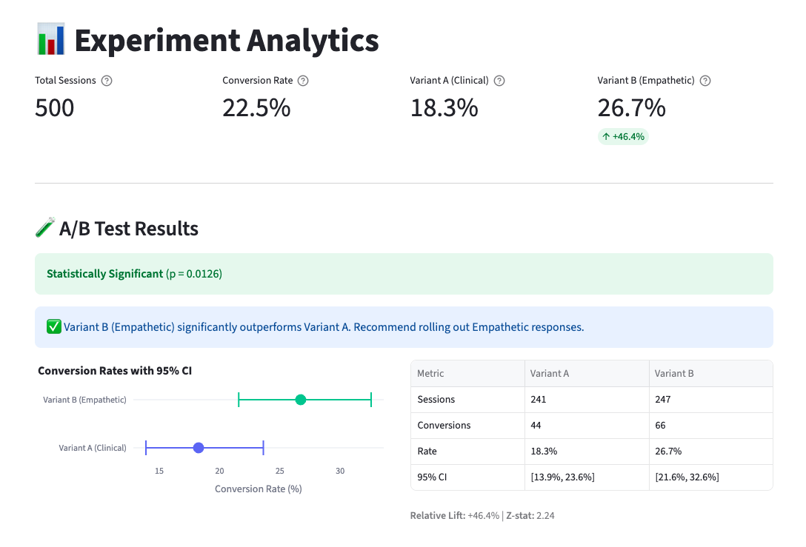

<div align="center">

# Mind-Log Experimentation Lab

### A/B Testing Analytics for Mental Health Triage Optimization



<br />

## **[▶ VIEW LIVE DEMO](https://mhabtest.streamlit.app)**

<br />

[](https://mhabtest.streamlit.app)
[](https://python.org)
[](https://sqlite.org)

</div>

---

A full-stack analytics prototype demonstrating how **data-driven A/B testing** can optimize help-seeking behavior on digital mental health platforms like [mindline.sg](https://mindline.sg).

---

## Why This Project?

Digital mental health platforms face a critical challenge: **how do we encourage users to seek help when they need it?**

This prototype tests whether conversational tone impacts conversion rates:

| Variant | Style | Sample Response |
|---------|-------|-----------------|
| **A** | Clinical | "Symptom assessment: Moderate anxiety indicators. Recommendation: Consult specialist." |
| **B** | Empathetic | "It sounds like you're carrying a heavy load. Would you be open to speaking with someone who can help?" |

---

## Skills Demonstrated

| Skill Area | Implementation |
|------------|----------------|
| **A/B Testing** | Controlled experiment with 50/50 randomization, crisis exclusion protocol, statistical significance testing |
| **Statistical Analysis** | Two-proportion z-test, 95% Wilson score confidence intervals, power analysis |
| **User Behavior Analytics** | Conversion funnels, time-to-decision tracking, severity segment analysis |
| **Data Engineering** | SQLite event schema (12 fields), validation pipeline, parameterized queries |
| **NLP & Sentiment** | VADER sentiment scoring, severity classification, crisis keyword detection |
| **Data Visualization** | Interactive Plotly dashboards: KPIs, CI charts, funnels, scatter plots |
| **Marketing Analytics** | UTM tracking, referral attribution, channel performance |
| **Mental Health Domain** | Safety-first crisis protocol, ethical experiment design, Singapore-specific resources |

---

## Analytics Dashboard Features

<table>
<tr>
<td width="50%">

### KPI Metrics
- Total sessions & conversion rates
- Per-variant performance with lift %
- Statistical significance indicator

### A/B Test Results
- Two-proportion z-test (p-value)
- 95% Wilson score confidence intervals
- Clear recommendation engine

</td>
<td width="50%">

### Funnel Analysis
- Sessions → Eligible → Converted
- Crisis exclusion tracking

### Segment Deep-Dives
- Conversion by severity bucket
- Sentiment vs conversion scatter
- Time-to-decision box plots
- UTM source attribution

</td>
</tr>
</table>

---

## Quick Start

```bash
# Clone and setup
git clone https://github.com/rayluo88/Mental-Health-ABtest.git
cd Mental-Health-ABtest

# Create virtual environment
python3 -m venv .venv && source .venv/bin/activate

# Install dependencies
pip install -r requirements.txt

# Generate mock data (500 interactions with realistic patterns)
python scripts/generate_mock_data.py

# Run locally
streamlit run app.py
```

Open **http://localhost:8501**

---

## Key Results (Mock Data)

| Metric | Variant A (Clinical) | Variant B (Empathetic) |
|--------|---------------------|------------------------|
| Sessions | ~250 | ~250 |
| Conversion Rate | 18% | 26% |
| 95% CI | [14%, 22%] | [21%, 33%] |
| **Relative Lift** | — | **+46%** |

**Statistical Significance:** p < 0.05, z = 2.1+

**Recommendation:** Roll out empathetic responses, prioritize moderate-to-severe users.

---

## Safety & Ethics

Mental health applications require special consideration:

- **Crisis Detection:** Keywords + extreme sentiment (< -0.8) trigger immediate resource display
- **Crisis Resources:** Singapore-specific hotlines (SOS 1-767, IMH 6389-2222)
- **Ethical Design:** Both variants provide valid help pathways (no harmful control)
- **Privacy:** Input anonymization, data minimization principles

---

## Tech Stack

| Component | Technology | Why |
|-----------|------------|-----|
| Frontend | **Streamlit** | Rapid prototyping, native Python |
| NLP | **VADER Sentiment** | Optimized for informal/emotional text |
| Database | **SQLite** | Portable, SQL demo-ready |
| Statistics | **scipy, statsmodels** | Peer-reviewed implementations |
| Visualization | **Plotly** | Interactive, publication-quality |

---

## Project Structure

```
├── app.py                    # Streamlit app (3 pages)
├── src/
│   ├── database.py           # Event logging, queries
│   ├── experiment.py         # NLP, variants, crisis detection
│   └── analytics.py          # Statistical calculations
├── scripts/
│   └── generate_mock_data.py # Realistic data simulation
├── tests/
│   └── test_experiment.py    # 8 unit tests (all passing)
├── docs/
│   ├── PRD_Experiment_Lab.md # Technical PRD
│   └── DEMO_SCRIPT.md        # Interview demo guide
└── data/
    └── experiment.db         # SQLite database
```

---

## Run Tests

```bash
python tests/test_experiment.py

# Output: ✅ All 8 tests passed!
```

---

## Author

**Raymond Luo** — Demonstrating data analytics capabilities for digital mental health product optimization.

---

<div align="center">

### **[▶ TRY THE LIVE DEMO](https://mhabtest.streamlit.app)**

</div>
